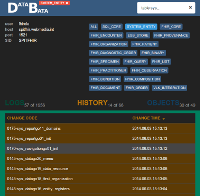
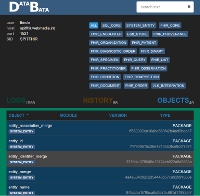

DataBata
========

DataBata is a tool for incremental database update based on HSQLDB SqlTool created for all types of workers: DBA, developers and QA. Currently Oracle and Postgres databases are supported. We plan to support all general RDBMSes.

For monitoring purposes there is DataBata Web Console.

[](https://raw.githubusercontent.com/nortal/DataBata/master/web_console_screen1.png)
[](https://raw.githubusercontent.com/nortal/DataBata/master/web_console_screen2.png)
[](https://raw.githubusercontent.com/nortal/DataBata/master/web_console_screen3.png)

What do you need to run DataBata?
========
- Java 6+
- Spring Framework
- Database driver
- HsqlDB sqltool (see (databata-engine/lib)[https://github.com/nortal/DataBata/tree/master/databata-engine/lib] folder)

Installation
========
Spring Framework: simply create following bean in your spring configuration
``` xml
<bean id="propagator" class="eu.databata.engine.spring.PropagatorSpringInstance"
		init-method="init">
		<property name="jdbcTemplate" ref="jdbcTemplate" />
		<property name="transactionManager" ref="transactionManager" />

		<property name="changes" value="WEB-INF/db/changes" />
		<property name="packageDir" value="WEB-INF/db/packages" />
		<property name="viewDir" value="WEB-INF/db/views" />
		<property name="triggerDir" value="WEB-INF/db/triggers" />
		<property name="useTestData" value="false" />
		<property name="disableDbPropagation" value="false" />
		<property name="enableAutomaticTransformation" value="true" />
		<property name="moduleName" value="DATABATA_TEST" />
</bean>
```
NB! You need to reference jdbcTemplate and transactionManager beans in your configurations. And sql-files location is inside WEB-INF directory of your web application. 

