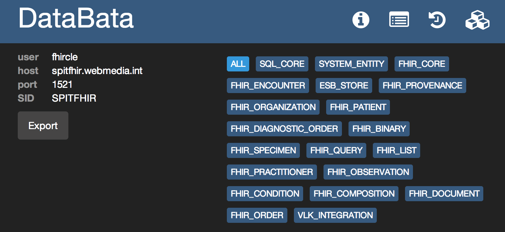

DataBata
========

DataBata is a tool for incremental database update based on HSQLDB SqlTool. Can be used by different types of people: DBA, developers and QA people.

Currently Oracle and Postgres databases are supported. It is in plan to implement support for others general RDBMSes.

Also it has great Web Console for monitoring the data.


What do you need to run
========
- Java 6+
- Spring Framework
- Database driver
- HsqlDB sqltool

Installation
========
Spring Framework: simply create following bean in your spring configuration
``` xml
<bean id="propagator" class="eu.databata.engine.spring.PropagatorSpringInstance"
		init-method="init">
		<property name="jdbcTemplate" ref="jdbcTemplate" />
		<property name="transactionManager" ref="transactionManager" />

		<property name="changes" value="WEB-INF/db/changes" />
		<property name="packageDir" value="WEB-INF/db/packages" />
		<property name="viewDir" value="WEB-INF/db/views" />
		<property name="triggerDir" value="WEB-INF/db/triggers" />
		<property name="useTestData" value="false" />
		<property name="disableDbPropagation" value="false" />
		<property name="enableAutomaticTransformation" value="true" />
		<property name="moduleName" value="DATABATA_TEST" />
</bean>
```
Note, you need reference to jdbcTemplate and transactionManager beans in your configuration.
Location of files in web application as you can see is inside WEB-INF directory. 

